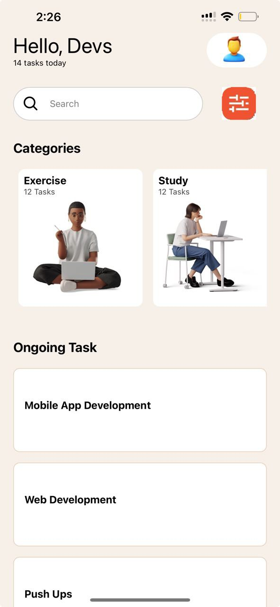

# Student Information
- Name: Theodore Gyaqueh Abbey
- Student ID: 11343393
  

# Task Management App

This project is aimed at recreating a task management application based on a provided UI mockup. The application includes various categories and an ongoing task list, utilizing React Native's core components.

## Table of Contents

- [Student Information](#student-information)
- [Task Management App](#task-management-app)
  - [Table of Contents](#table-of-contents)
  - [Introduction](#introduction)
  - [Features](#features)
  - [Prerequisites](#prerequisites)
  - [Installation](#installation)
  - [Usage](#usage)
- [Screenshot](#screenshot)

## Introduction

This project is a task management application that helps users organize and keep track of their tasks. The design follows a provided UI mockup, ensuring a visually appealing and user-friendly interface.

## Features

- Recreate the design as seen in the UI mockup.
- Use core React Native components:
  - `View`
  - `Text`
  - `ScrollView`
  - `TextInput`
  - `Stylesheet`
  - `Button`
  - `FlatList` or `SectionList` for rendering lists of tasks.
  - `Image` for icons and displaying images
- Include at least eight categories such as Exercise, Study, Code, Cook, etc.
- Provide a list of 15 ongoing tasks.
- Style the application to closely match the provided UI design.
- Use custom components throughout the application.

## Prerequisites

Before you begin, ensure you have met the following requirements:
- You have installed the latest version of Node.js and npm.
- You have installed React Native CLI or Expo CLI.
- You have a development environment set up for React Native (iOS/Android emulator or a physical device).

## Installation

1. Clone the repository:
    ```sh
    git clone https://github.com/your-username/task-management-app.git
    cd task-management-app
    ```

2. Install the dependencies:
    ```sh
    npm install
    ```

3. Start the development server:
    ```sh
    npm start
    ```

4. Run the application on an emulator or physical device:
    ```sh
    npx react-native run-android
    # or
    npx react-native run-ios
    ```

## Usage

1. Open the app on your emulator or physical device.
2. Navigate through the categories such as Exercise, Study, Code, Cook, etc.
3. View the list of ongoing tasks.
4. Add, edit, or remove tasks as needed.


 # Screenshot
